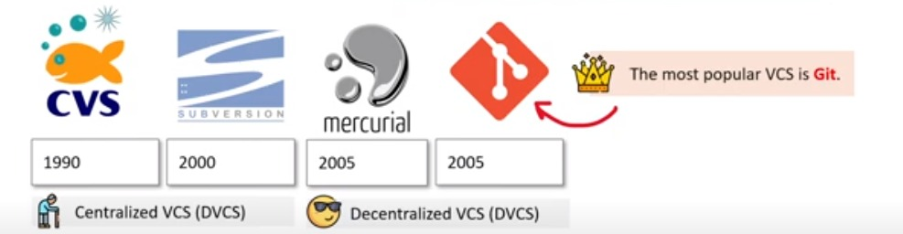

## Qu'est-ce que les fondations Github

Les Github Foundations sont la certification Github d'entrée de gamme qui enseigne :

+ Bases du contrôle de version Git
+ Travailler avec les référentiels Github
+ Fonctionnalités collaboratives
+ Développement moderne
+ Gestion de projet
+ Confidentialité, sécurité et administration de Github
+ Communauté Github et Open Source

     + Le code non officiel du cours est le GHF

Github est le leader du contrôle de version dans le <b>monde !</b>
Github <b>est le moyen le plus courant</b> pour les développeurs de présenter leur code

 

## A qui s'adresse cette Certification ?

Considérez les fondations Github si….

+ Vous débutez en programmation cloud et devez apprendre les principes fondamentaux du contrôle de version.
+ Vous occupez un rôle technique non-développeur qui cherche à ajouter rapidement des compétences de développeur.
+ Vous souhaitez collaborer efficacement sur une base de code avec d'autres développeurs.

 

La certification Github <u>ne testera pas vos compétences Git</u>, elle se concentre sur Github.
Vous utiliserez git, mais vous pourriez <b>avoir de sérieuses lacunes dans vos connaissances sur Git</b>.

## La feuille de route de la certification Github

<!DOCTYPE html>
<html lang="en">
<head>
<meta charset="UTF-8">
<meta name="viewport" content="width=device-width, initial-scale=1.0">
<title>Aligner des images sur une même ligne</title>

</head>
<body>

  
  
  
  

</body>
</html>

## Github - Systèmes de contrôle de version

+ Systèmes de contrôle de version (VCS) conçus pour suivre les modifications ou les révisions du code.

DVCS (et git en particulier) est devenu très populaire pour de nombreuses raisons :
+ Historique local complet et compléter une copie du dépôt localement
+ Branchement et fusion simples et efficaces
+ De meilleures performances, une tolérance aux pannes améliorée, des flux de travail flexibles, travaillez entièrement en ligne.

Le contrôle de version représente normalement les révisions représentées sous forme de structure de type graphique.
Vous trouverez donc ici des termes comme <u>arbre, tronc</u> et <u>branches</u>

## Git

