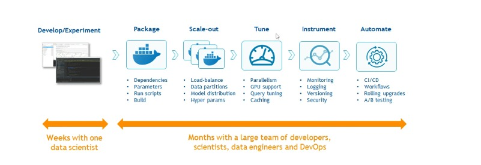

# Challenges and evolution of ML

| Lecture  |
|----------|
|3. Introduction à l'apprentissage automatique|
|4. Avantages de l'apprentissage automatique|
|5. Fondamentaux du MLOps|
|6. Fondamentaux du DevOps et du DataOps|

## Introduction à l'apprentissage automatique

#### 1) Histoire de l'IA

 

#### **2) Défis**

+ **Selon un sondage, 55% des entreprises n'ont jamais déployé de modèle. Principales raisons : manque de talent, manque de processus pour gérer le changement et manque de systèmes automatisés.**

#### **3) Les tendances**

## **Avantages du Machine Learning**

#### 1) Avantages

+ **Les organisations qui ont mis l'IA en production ont vu leur marge bénéficiaire passer de 3 % à 15 %.**
+ **Le marché des MLOps était estimé à 23,2 milliards de dollars en 2019.**
+ **Il devrait atteindre 126 milliards de dollars d'ici 2025 en raison
à une adoption rapide.**

## **Fondamentaux du MLOps**

#### **1) Qu'est-ce que MLOps?**
+ **La création de modèles doit être évolutive, collaborative et reproductible. `Les principes, outils et techniques qui rendent les modèles évolutifs, collaboratifs et reproductibles sont connus sous le nom de MLOps`.**

#### **2) Processus MLOps**

## **Fondamentaux du DevOps et du DataOps**

+ **Dans cette tâche, nous apprendrons des concepts importants tels que `DevOps` et les opérations de données. `DevOps` est une approche itérative du déploiement d'applications logicielles en production, et `MLOps` emprunte les mêmes principes de `DevOps` en les appliquant à l'apprentissage automatique et au `MLOps` permet de mettre en production des modèles d'apprentissage automatique de manière itérative, qu'il s'agisse de `DevOps ou MLOps`.Le but ultime est le même.***

+ **L'objectif ultime est une meilleure qualité et un meilleur contrôle des applications logicielles et des modèles d'apprentissage automatique envoyé à la fabrication.***

+ **Non seulement nous avons appliqué le terme `DevOps` à l'apprentissage automatique, mais nous l'avons également appliqué aux données. Le `DevOps` appliqué aux données est ce qu'on appelle les opérations de données.***

+ **Les opérations de données impliquent un ensemble de règles qui garantissent la disponibilité de données de haute qualité pour la formation de modèles.***

+ **D'une part, nous avons la partie de l'apprentissage automatique. Dans cette partie, nous développons non seulement les différents modèles, mais aussi l'acquisition de données, la compréhension des besoins de l'entreprise et le développement de modèles initiaux.***

+ **Ensuite, nous aurions la partie DevOps. Cette partie applique `les tests, l'intégration et le développement continus`.***

+ **`L'intégration continue et le déploiement continu` sont des pratiques d'automatisation de `l'intégration et du déploiement`. Disons que nous avons terminé le développement de notre modèle d'apprentissage automatique et avons tout notre code dans un référentiel de contrôle de version parce que nous travaillons en équipe, de nombreuses personnes travaillent sur différentes parties du code.**

+ **Nous devons intégrer tous les changements d'une manière ou d'une autre et implémenter le dernier code dans tous nos développements et productions d'environnements. C'est lorsque nous appliquons `l'intégration continue et le déploiement continu`.**

+ **Enfin, nous aurions la partie des MLOps liée à l'exploitation. Dans cette partie, nous avons `la livraison continue, la boucle de retour de données et le suivi du modèle. La boucle de rétroaction des données` aide le modèle à apprendre de ses erreurs en renvoyant des données mal prédites. Sans cela, un modèle d'apprentissage automatique a tendance à aggraver ses métriques au fil du temps, car il ne s'adapte pas aux modifications des données.**

+ **Quant à la surveillance, elle est tout aussi importante dans le développement logiciel que dans la science des données. Nous devons surveiller le modèle pour que les utilisateurs soient constamment satisfaits.**

+ **Lorsque nous avons appliqué toutes les méthodologies de boucles, nous sommes passés d'un rôle unique, qui serait le data scientist pour avoir beaucoup plus de rôles avec `MLOPS`.**

  + **`Le scientifique des données` s'inquiéterait de la formation du modèle et de savoir pourquoi le modèle ne donne pas de bons résultats.**

  + **Ensuite, nous aurions `le responsable de la science des données`. Il est chargé d'évaluer s'il est temps de recycler le modèle ou s'il a besoin de modifications supplémentaires.**

  + **`Le chef de produit` est chargé d'identifier les besoins du client et de faire connaître le modèle limite.**

  + **`L'ingénieur de données` est chargé d'obtenir les données de différentes sources, de les extraire et les corrigeant.**

  + **Ensuite, nous aurions `le responsable qualité`. Le responsable qualité est celui qui s'assure que le modèle que nous utilisons est adapté et sûr. La partie support est chargée d'aider l'entreprise à appliquer ce modèle.**

  + **`L'acteur métier` est responsable de la valorisation du modèle dans l'entreprise.**
  
  + **Enfin, `l'utilisateur` utilise le modèle pour obtenir des prédictions. Aussi, il comparera les résultats du modèle avec sa connaissance du métier pour savoir s'il est fiable.**

