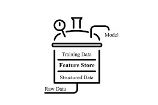
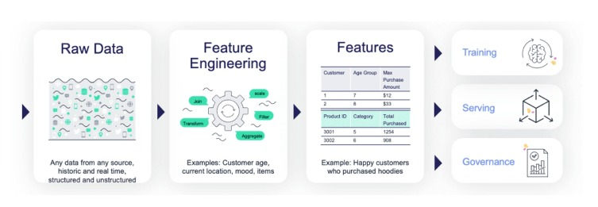
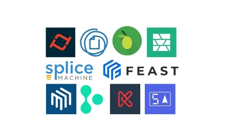
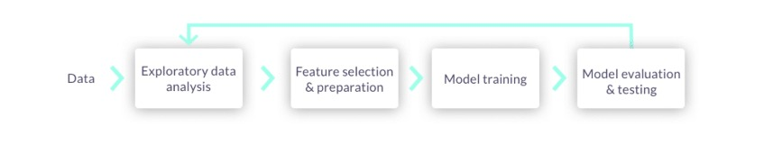
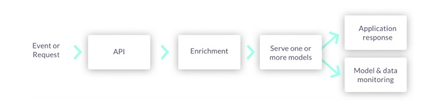
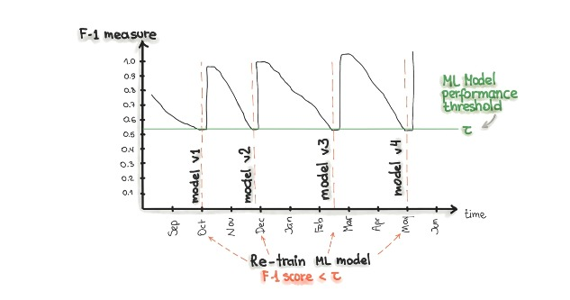

# Section 3 : MLOps Fundamentals

| Lecture                        |
|--------------------------------|
| 7. Problèmes résolus par MLOps |
| 8. Composants MLOps            |
| 9. Boîte à outils MLOps        |
| 10. Étapes MLOps               |

## **Problèmes résolus par MLOps**

## **1) Défis relevés par MLOps**

| Gestion des versions                                                                                                                                                              | Suivi du modèle                                                                                            | Génération de fonctionnalités                                                                                                                           |
|-----------------------------------------------------------------------------------------------------------------------------------------------------------------------------------|------------------------------------------------------------------------------------------------------------|---------------------------------------------------------------------------------------------------------------------------------------------------------|
| Des outils tels que **Git et Github** sont utilisés dans le contrôle de version du code. De plus, les **données et artefacts** sont versionnés pour garantir la reproductibilité. | Les modèles en production peuvent être **dégradés** au fil du temps en raison d'une **dérive des données** | Cela demande beaucoup de ressources. `MLOps` permet de `réutiliser des fonctions`. Ainsi, vous pouvez vous concentrer sur la conception/test du modèle. |
|                                                                                                                                                  |                                                                       |                                                                                                                |

## **Composants MLOps**

+ ### **Magasin de fonctionnalités**
  + Stocke les fonctions qui ont été utilisées dans la formation du modèle.
+ ### **Versionnage des données**
  + Le contrôle des versions des données garantit la reproductibilité et facilite l'audit.
+ ### **Magasin de métadonnées**
  + C'est essentiel pour la reproductibilité. Tout doit être enregistré, de la graine du modèle aux métriques d'évaluation...
+ ### **Gestion des versions du modèle**
  + Vous permet de basculer entre les modèles en temps réel ou de servir différents modèles à surveiller.
+ ### **Enregistrement du modèle**
  + Une fois qu'un modèle a été entraîné, il est stocké dans un registre de modèles avec ses métadonnées.
+ ### **Service de modèle**
  + Servir un modèle signifie créer des points de terminaison qui peuvent être utilisés pour exécuter des prédictions.
+ ### **Surveillance du modèle**
  + Les modèles doivent être surveillés pour détecter les biais de dérivation et de production.
+ ### **Recyclage des modèles**
  + Les modèles peuvent être recyclés pour améliorer les performances ou lorsqu'il y a de nouvelles données.
+ ### **CI/CD**
  + Cela garantit que le code est fréquemment fusionné avec des processus et des tests automatisés.

### **MLOps Toolbox**

## **Étapes MLOps**

+ `Étape 1`:Contrôle de version du modèle et des données
+ `Étape 2`: `AutoML` + Contrôle de version du modèle et des données.
+ `Étape 3`: AutoML + Contrôle de version des modèles et des données + `Service de modèles`
+ `Étape 4:` AutoML + Contrôle des versions de modèles et de données + Service de modèles + `Surveillance, gouvernance et recyclage`.

#### **1) `Étape 1`:Contrôle de version du modèle et des données**

+ **Il n'y a pas de ML sans données. Les équipes ML ont besoin d'accéder à des données historiques et/ou en ligne provenant de plusieurs sources. Ils doivent cataloguer et organiser ces données. Les données brutes ne peuvent pas être utilisées, elles doivent traiter ces données.**

  

+ Les solutions MLOps doivent intégrer un stockage de fonctionnalités qui :
1. Définissez la collecte et les transformations de données une seule fois pour les scénarios de traitement par lots et de diffusion en continu
2. Fonctions de processus automatiquement sans intervention manuelle
3. Servir les fonctions d'un catalogue partagé pour les applications de formation, de service et gouvernementales

  

#### 2) `AutoML` + Contrôle de version du modèle et des données

+ **Toutes les exécutions, ainsi que leurs données, métadonnées, code et résultats, doivent être versionnées et enregistrées**
+ **Le développement du modèle suit généralement le même processus. Une grande partie peut être automatisée grâce à AutoML et MLOps**

  

#### 3) AutoML + Contrôle de version des modèles et des données + `Service de modèles`

+ Une fois qu'un modèle a été créé, il doit être intégré à l'application métier ou aux services frontaux. Ils doivent être mis en œuvre sans interruption de service. Les pipelines de production mettent en œuvre :
  + Collecte de données en temps réel, validation des données et ingénierie des fonctionnalités
  + Services API ou intégration d'applications
  + Services de surveillance des données et des modèles
  + Services de surveillance et d'alerte des ressources
  + Services de télémétrie et de journalisation des événements

  

#### 4) AutoML + Contrôle des versions de modèles et de données + Service de modèles + `Surveillance, gouvernance et recyclage`
+ **La surveillance des modèles est un composant central des MLOps pour maintenir les modèles à jour et prévoir avec une précision maximale. Il garantit la validité du modèle à long terme.**

  

  

## **Les phases clés des MLOps sont:**

  + Collecte de données(Data gathering)
  + L'analyse des données(Data analysis)
  + Transformation/préparation des données(Data transformation/preparation)
  + Développement d'un modèle(Model development)
  + Formation modèle(Model training)
  + Validation du modèle(Model validation)
  + Modèle servant(Model serving)
  + Surveillance du modèle(Model monitoring)
  + Re-formation du modèle(Model re-training)

