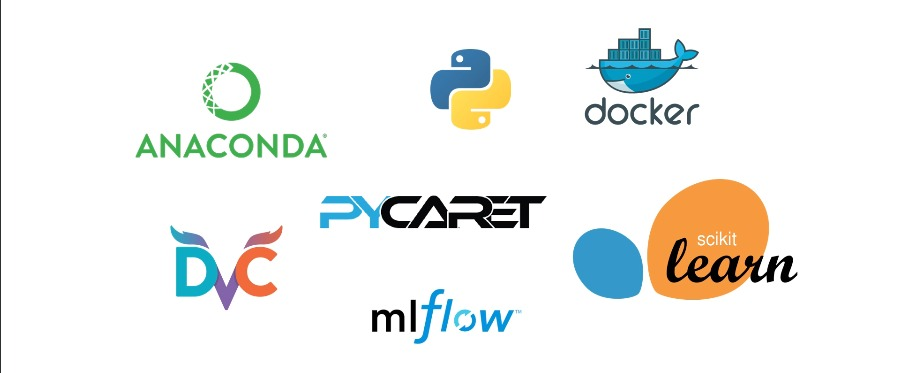
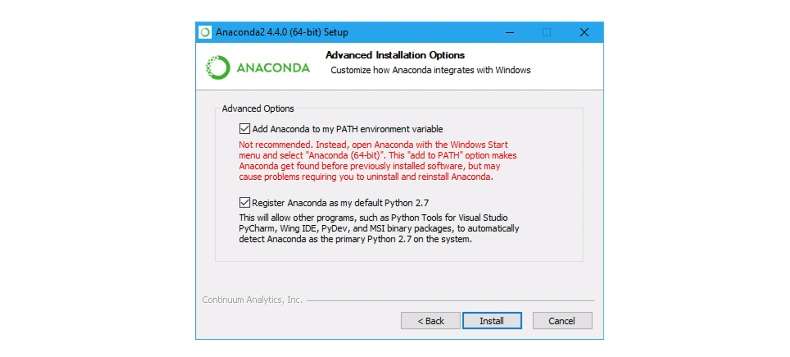
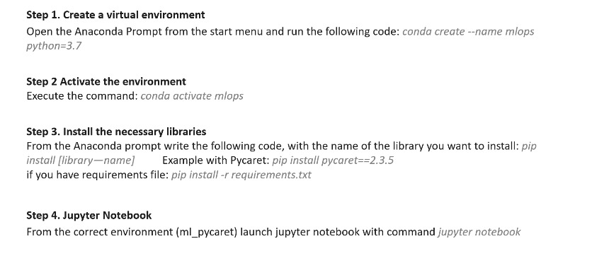
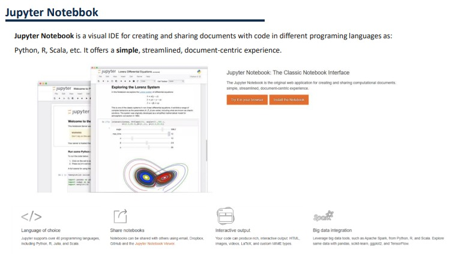
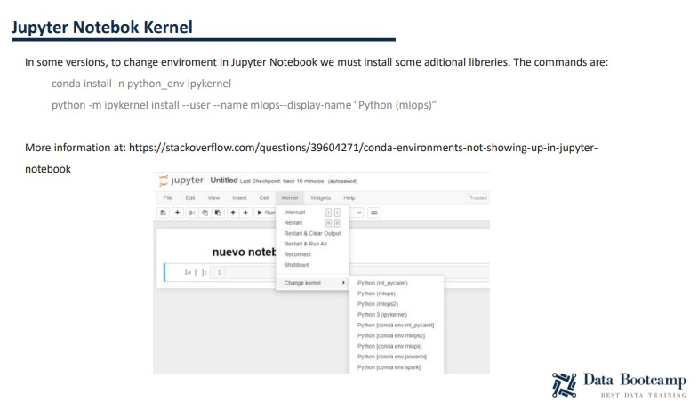

# Installation des Outils et Librairies

| PLAN                                                                |
|---------------------------------------------------------------------|
| 11. Comment installer les bibliothèques et préparer l'environnement |
| 12. Bases du bloc-notes Jupyter                                     |
| 13. Installation de Docker et Ubuntu                                |

## Comment installer les bibliothèques et préparer l'environnement

#### I) Outils à Utiliser

#### II) Facilité

+ Si c'est la première fois que vous utilisez Python, vous devez installer Anaconda Distribution avec Python 3.7 ou supérieur.

  + https://www.anaconda.com/products/individual

#### II) Variable d'environnement

#### III) Définir l'environnement

## Bases du bloc-notes Jupyter 

## **Installation de Docker et Ubuntu**

+ Pour installer Docker, nous devons suivre les étapes suivantes :

  + **1. Téléchargez Docker Desktop et installez :**

    + https://docs.docker.com/desktop/windows/install/

  + **2) Cliquez sur le fichier executable :**
    + *`"Docker Desktop for windows"`*

  + **3) Ouvrir ce fichier il apparait une fenêtre de configuration, cocher la case OK.**

  + **4) Il apparait un message(`WSL2 Installation Is Incomplete`): cliquez sur le lien ci-dessous.**

  + **5) Installez le sous-système Windows pour Linux (aller à l'étape 4 et cliquez sur le message bleu apparaissant)**

    + https://docs.microsoft.com/en-us/windows/wsl/install-manual

  + **6) Aller dans à l'étape 5 de Powershell : copier la commande (`wsl --set default-version 2`) et coller dans le powershell**

  + **7) Aller à l'étape 6 Installez Ubuntu: cliquez sur le message bleu(Microsoft store) et selectionnez ubutntu**

  + **8) Au niveau du terminal Ubuntu, créer un compte**
	  + [username](etdata)
	  + [password](1995)
  

