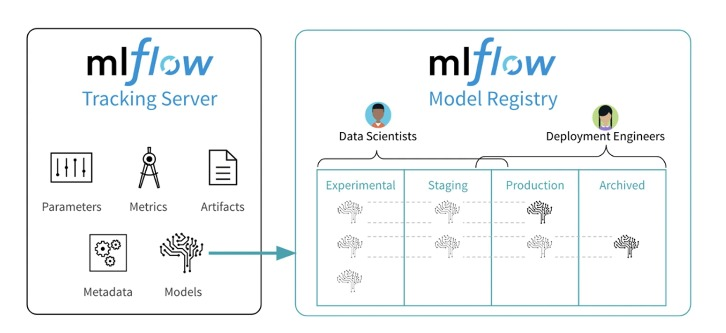
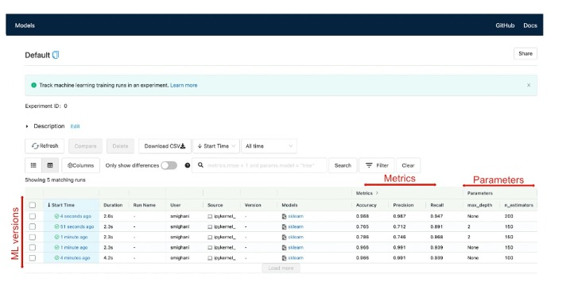
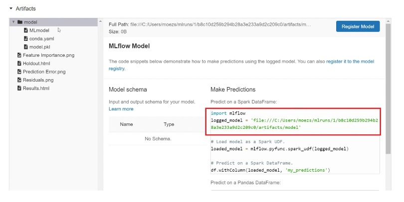
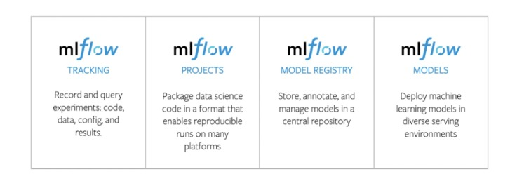

## Model registration and versioning

| PLAN                                                        |
|-------------------------------------------------------------|
| 30. Registre de modèles et gestion des versions avec MLFlow |
| 31. Enregistrement d'un modèle Scikit-Learn avec MLFlow     |
| 32. Enregistrement d'un modèle Pycaret avec MLFlow          |

## Registre de modèles et gestion des versions avec MLFlow 

#### **1) Étapes MLOps**

#### **2) Outils pour MLOps**

+ `MLflow` est une plate-forme open source pour la gestion du cycle de vie `ML`, y compris l'expérimentation de modèles, la reproductibilité, le déploiement et l'enregistrement.

#### **3) MLflow Platforme**

#### **4) Enregistrement et gestion des versions avec MLFlow**

+ Pour pouvoir entrer un code à partir de rien dans `MLflow`, suivez ces étapes :

  + https://www.mlflow.org/docs/latest/tutorials-and-examples/tutorial.html

