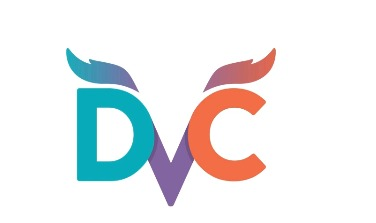
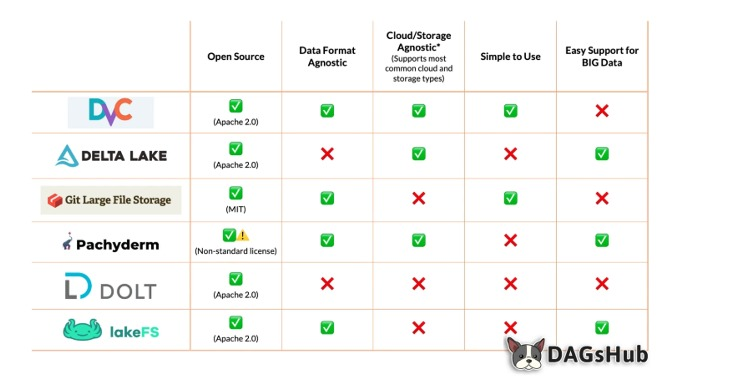
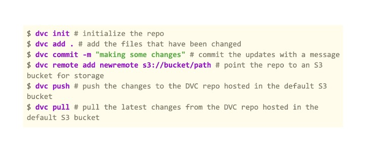
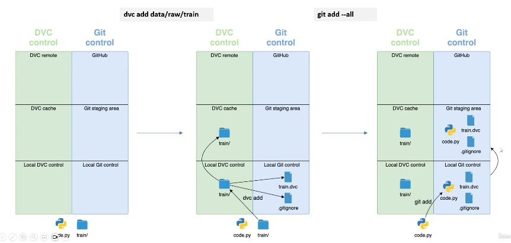
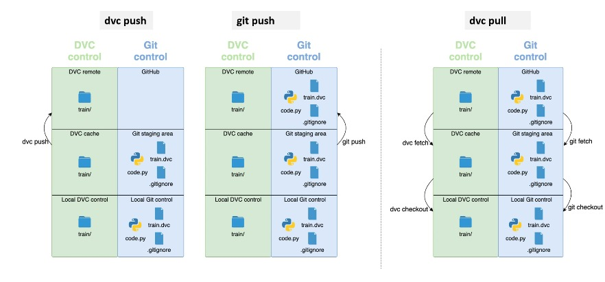
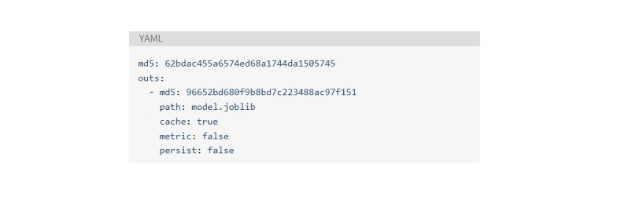
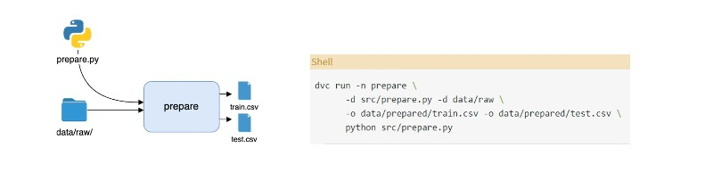
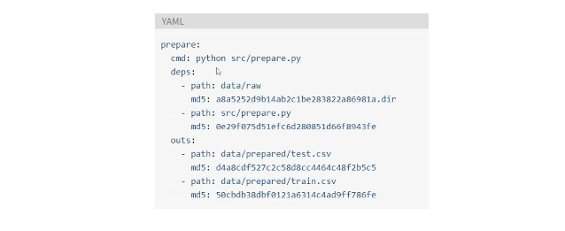
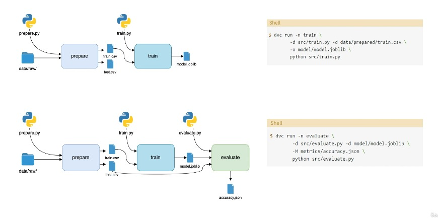

# **Versioning dataset with DVC**

| Lecture                           |
|-----------------------------------|
| 33. Introduction au DVC           |
| 34. Commandes et processus DVC    |
| 35. Laboratoire pratique avec DVC |
| 36. Pipelines DVC                 |

## **Introduction au DVC  **

#### **1) DVC**

+ `Git` ne peut pas être poursuivi pour le versionning des jeux de données, en particulier avec les grands jeux de données. Pour le versionnage des jeux de données, nous avons `DVC`, qui s'intègre avec `Git`. Il s'agit d'un outil de ligne de commande open source qui imite les flux et les commandes Git.
+ Caractéristiques `DVC` :
   + `conforme à Git`
   + Contrôle facile de la version des données
   + Stockage indépendant
   + Reproductible
   + Indépendant du langage et du framework
   + Ramification à faible frottement
   + Facile à utiliser



#### **2) Comparatif d'outils**

+ Ensuite, nous avons une comparaison de différents outils de stockage de données :



#### **3) Commandes DVC**
+ **Commandes principales DVC pour télécharger des données vers un environnement distant.**



## Commandes et processus DVC

#### 1) Suivi des fichiers avec DVC
+ **Les fichiers et dossiers de données volumineux vont au stockage distant DVC, mais les petits fichiers `.dvc` vont à Github.**



#### 2) Téléchargez et téléchargez des fichiers avec DVC


#### 3) Fichiers DVC
+ **Les fichiers DVC sont des fichiers YAML. Les informations sont stockées dans des paires clé-valeur et des listes. La première clé est `MD5` suivie d'une chaîne de caractères. `MD5` est une fonction de hachage. Deux fichiers exactement identiques produiront le même hachage.**




## Laboratoire pratique avec DVC

```
  pip install dvc
  # Copy and paste your directory anaconda/scripts in variablle environment -> Path
  pip install dvc[gdrive]

  500  dvc init --no-scm or dvc init --subdir

  501  git commit -m "Initaliaze DVC"
  507  cd data
  508  mkdir data
  509  cd data/
  510  touch train.ipynb
  511  cd ..
  512  dvc add data
  513  git add data.dvc
  514  git commit -m 'add data'
  515  touch .gitignore
  516  git add data/.gitignore
  517  git add data .gitignore
  518  git commit -m "ignore raw data"
  519  dvc remote add -d remote gdrive://1hyVwGr6OLsBFFoY4zXjSQXEqyUBnQlnp
  520  git commit .dvc/config -m "Configure remote storage"
  524  git add .
  525  dvc push
  526  dvc add data
```

## Pipelines DVC  

#### 1) Pipelines DVC 

+ `DVC` permet de `chaîner les fichiers` de l'ensemble du processus en une seule exécution appelée `DVC Pielines` qui nécessite l'exécution d'une seule commande : `dvc repro`.

+ Un pipeline se compose de plusieurs étapes, et chaque étape comporte trois composants :
   + Dépendances
   + Sorties
   + Commande




#### 2) Commandes DVC

+ DVC créera deux fichiers :

  + `dvc.yaml`
  + `dvc.lock` 
  
+ Les informations internes des deux fichiers sont similaires, avec des hachages `MD5` dans `dvc.lock`.



#### 3) Exemple de Pipelines DVC

