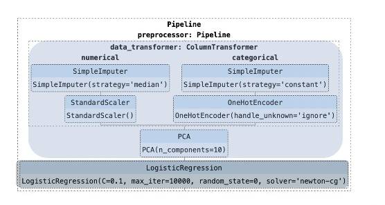

### **Mise en production des modèles**

### **I) Étapes MLOps**

### **II) Déploiement de modèles en production**

+ `Le déploiement de modèle` consiste à intégrer `un modèle` dans un environnement de production pour prendre des décisions commerciales basées sur les données.

+ `Les modèles` doivent être disponibles pour `les applications Web, les logiciels d'entreprise (ERP) et les API`, afin de fournir des prédictions sur les nouvelles données.

### **III) Servage de modèles**
+ Il existe différentes alternatives pour déployer un modèle dans un environnement de production :
  + **1) Via l'API**
  + **2) Via une application (mobile/web)**

