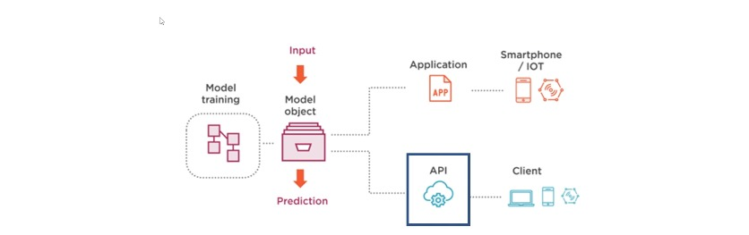
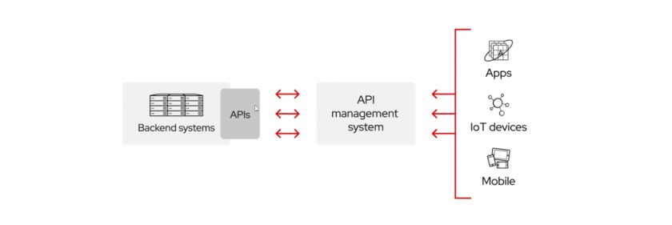
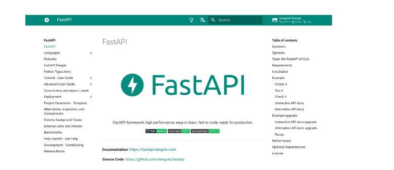
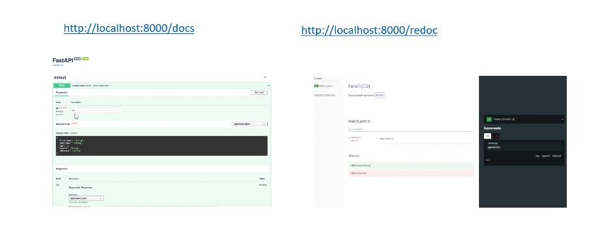
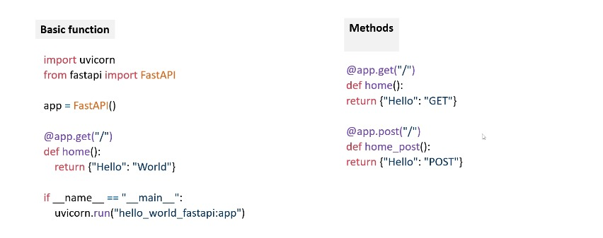
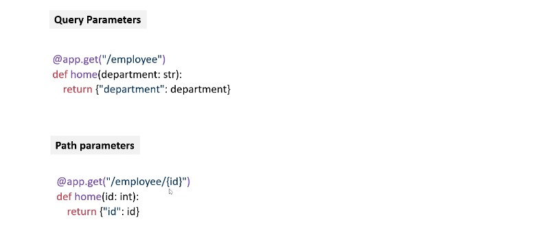
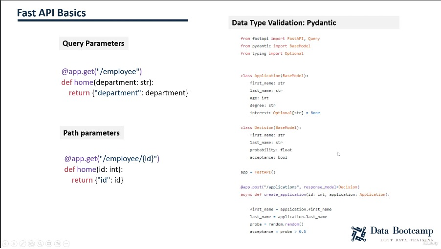

# **MLOps phase 3: diffusion de modèles via des API**

| PLAN                                                             |
|------------------------------------------------------------------|
| 63. Fondamentaux des API et FastAPI                              |
| 64. Fonctions, méthodes et paramètres dans FastAPI               |
| 65. Méthode POST, Swagger et Pydantic dans FastAPI               |
| 66. Développement d'API pour le modèle Scikit-learn avec FastAPI |
| 67. Développement d'API automatisé avec Pycaret                  |

## Fondamentaux des API et FastAPI 

#### I) Servage de modèles

+ Voici différentes alternatives pour déployer un modèle dans un environnement de production :
   + 1. Grâce à
   + 2. Via des applications (mobile/web)

#### **II) Qu'est-ce qu'une API**

+ `API (Application Programming Interface)` crée un point d'entrée pour une application, via des requêtes `HTTP`.
+ `API : ` Abstraction des applications + Simplification de l'intégration tierce.

#### **III) Codes d'état et méthodes HTTP**

| Méthode HTTP                                                    |
|-----------------------------------------------------------------|
| `GET : ` récupérer une ressource existante (lecture seule)      |
| `POST : ` Créer une nouvelle ressource/envoyer des informations |
| `PUT : ` Mettre à jour une ressource existante                  |
| `PATCH :` mettre à jour partiellement une ressource existante   |
| `DELETE : ` Supprimer une ressource                             |

 

| Code d'état HTTP          |
|---------------------------|
| `2xx : `Opération réussie |
| `3xx : ` Redirection      |
| `4xx : `Erreur client     |
| `5xx :` Erreur du serveur |

#### IV) FastAPI

+ Il s'agit d'un cadre de référence pour `créer des KPI robustes et performants` pour les environnements de production.

#### **V) Documentation API**

+ L'exploration et la documentation interactives de l'API sont automatiquement générées.
  
   + http://localhost:8000/docs

   + http://localhost:8000/reloc

## Fonctions, méthodes et paramètres dans FastAPI

#### I) Fast API Basics

