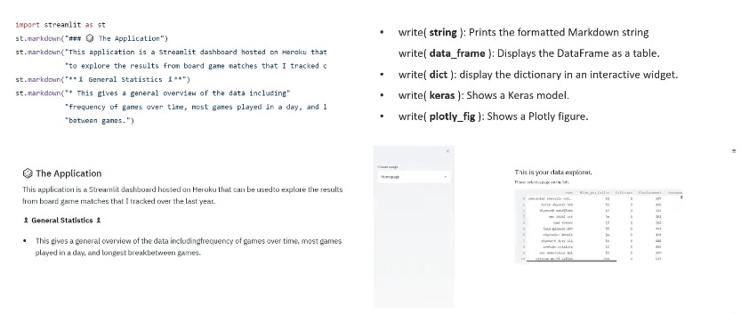

# **Section 15 : MLOps phase 3 : Servage de modèles avec des applications Web**

| PLAN                                                                    |
|-------------------------------------------------------------------------|
| 68. Servir le modèle via une application Web                            |
| 69. Commandes de base de Gradio                                         |
| 70. Développement d'une application web Gradio pour le Machine Learning |
| 71. Développement automatisé d'applications Web avec Pycaret            |
| 72. Web application development with Streamlit                          |
| 73. Laboratory_ Web application development with Streamlit and Altair   |
| 74. Laboratory_ Streamlit and Pycaret to develop a ML web service       |

## Servir le modèle via une application Web

#### **I) Servage de modèles**
+ Il existe différentes alternatives pour déployer un modèle dans un environnement de production :
  + **1) Via l'API**
  + **2) Via une application (mobile/web)**

#### II) Créer une application Web

+ Un `utilisateur professionnel` n'exécutera pas de code ou de notebook pour obtenir une prédiction. Pour cette raison, il est conseillé de faciliter le processus via un `front-end (application web, mobile, etc.)`.

## Commandes de base de Gradio 

#### I) Les bases de Gradio

+ Ici, vous pouvez accéder à la documentation [Gradio](https://gradio.app/getting_started/)

+ L'interface possède trois paramètres obligatoires :
  + `fn` : la fonction à utiliser dans l'interface utilisateur.
  + `inputs` : quel(s) composant(s) utiliser pour l'entrée, exemple : `text`, `image` ou `audio`.
  + `outputs` : quel(s) composant(s) utiliser pour la sortie, exemple : `text`, `image`, `label`.

## Web application development with Streamlit  

#### I) Fondamentaux rationalisés

+ Avec `Streamlit`, développer une `application web` pour le modèle ML est devenu incroyablement simple.

+ `Avantages` de l'utilisation de Streamlit :
  + Connaissances `HTML` non nécessaires !
  + Code bas
  + Les widgets sont des variables
  + Mise en cache

#### II) Widgets

+ L'une des principales fonctionnalités de Streamlit est l'utilisation de `Widgets`. De nombreux widgets sont disponibles, dont les suivants :

#### III) Mise en cache et graphiques

+ Dans de nombreux outils, les données sont **rechargées** à chaque sélection. Streamlit peut **mettre en cache les données** et ne les exécuter que si elles n'ont pas encore été exécutées.
+ `Prend en charge de nombreuses `bibliothèques de visualisation (Matplotlib, Altair, Plotly, Bokeh, etc.)`.
+ Peut même charger de l'audio et de la vidéo

#### IV) Markdown et écriture

+ Streamlit propose de nombreuses options pour `Markdown` et la personnalisation du `readme`. De plus, la **fonction Write** `s'adapte` automatiquement en fonction des types de données d'entrée.

