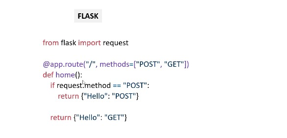

# **SECTION 16 : Flask pour developpement d'applications**

| PLAN                                                                              |
|-----------------------------------------------------------------------------------|
| 72. Principes fondamentaux de Flask                                               |
| 73. Construire un projet du début à la fin avec Flask                             |
| 74. Développement back-end avec Flask et développement front-end avec HTML et CSS |

## **72. Principes fondamentaux de Flask**

#### **I) Flask**

+ `Flask` est un framework de développement web écrit en `Python`. Prend en charge plusieurs « extensions ». `Flask` est très facile à apprendre et rapide à mettre en œuvre.

+ Avantages :
   + Facile à utiliser
   + Flexible
   + Permet de tester

#### **II) Fonctionnalités de Flask : syntaxe simple**

#### **III Fonctionnalités Flask : définir des itinéraires**

+ Ensuite, nous voyons comment nous pouvons `définir les itinéraires`

#### **IV) Caractéristiques de flask**

+ Ensuite, nous avons `les paramètres de route et de requête`

## Construire un projet du début à la fin avec Flask

#### **I) Créez une application avec Flask et HTML**

+ Nous allons développer une application web basée sur `Flask`. 
+ Vous aurez besoin d'un `back-end Flask et d'un front-end` pour un exemple en `HTML`. Ensuite, cette application doit être déployée sur un serveur (cloud ou sur promesse) tel qu'`Azure`, `Heroku`, etc.

