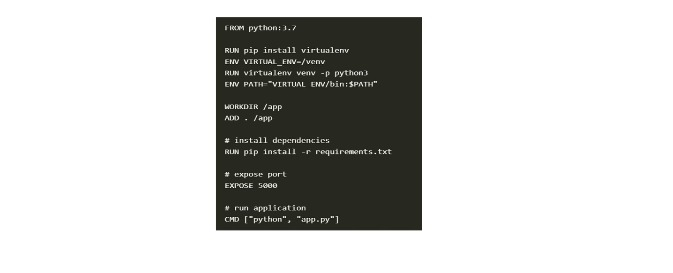

# Docker et conteneurs en Machine Learning

|PLAN|
|----|
|75. Des conteneurs pour isoler nos applications|
|76. Bases de Docker et Kubernetes|
|77. Générer un conteneur pour une API ML avec Docker|
|78. Docker pour générer un conteneur d'une application Web à partir de Flask, HTML|


## Des conteneurs pour isoler nos applications

<br/>

**1) MLOps Toolbox**


**2) Défis liés aux environnements**

+ Combien de fois votre code fonctionne sur votre ordinateur mais pas sur les commandes ? Cela est dû aux différents environnements Python.

+ Un environnement comprend toutes les bibliothèques et dépendances utilisées pour créer une application. Si nous pouvons transférer cet environnement dans un conteneur, le modèle peut être utilisé ailleurs.


**3) Solutions pour les environnements**

+ Alternatives pour créer un environnement isolé pour notre application.
    + **Avoir une machine à séparer**
    + **Utiliser des machines virtuelles**
    + **Conteneur**


## Bases de Docker et Kubernetes

**1) Docker**

+ `Docker` est un outil pour faciliter la création, le déploiement et l'exécution d'applications utilisant des conteneurs. Ceux-ci vous permettent de regrouper une application avec tous ses composants et de l'expédier sous la forme d'un seul package.


**2) Résumé**


**3) Création d'un conteneur**

+ Afin de créer un conteneur, nous devrons générer un `Dockerfile` avec les bibliothèques nécessaires pour le modèle. Ensuite, nous générons le `Docker Image`, qui contient toutes les informations pour l'exécution du modèle.



## Générer un conteneur pour une API ML avec Docker

**1) Conteneur pour une API**

+ `Pycaret` vous permet de créer facilement un conteneur pour qu'une API consomme un modèle de `Machine Learning`.


**2) Conteneur d'application Flask**

+ Nous allons générer un `conteneur Docker` pour notre application Web. Cette application est développée avec `Flask` et `HTML` et intégrera un modèle d'apprentissage automatique.


**3) Conteneur d'application Flask**

nous allons générer un conteneur `Docker` pour notre application. Pour cela, nous suivrons les étapes suivantes :

1. Préparez l'environnement `cd/path` et `pip install -r requirements.txt`
2. Créez le `requirements.txt` et le `Dockerfile`
3. Construisez l'image Docker avec :
  
```
  docker build -t pycaret.azurecr.io/pycaret-insurance:latest
```
4. Test en cours :

```
docker run -d -p 5000:5000 pycaret.azurecr.io/pycaret-insurance
```