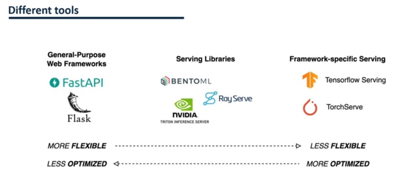

# **BentoML**


| Lecture   |
|-----------|
|82. Introduction à BentoML pour générer des services ML|
|83. Générer un service ML avec BentoML|
|84. Mettre le service en production avec BentoML et Docker|
|85. Intégration BentoML et MLflow et modèles personnalisés|
|86. GPU, prétraitement, validation des données et modèles multiples dans BentoML|
|87. Différents outils pour développer des services ML|
|88. Exercice : Utiliser BentoML pour développer un service ML|
|89. Solution d'exercice : utiliser BentoML pour développer un service ML|


## Introduction à BentoML pour générer des services ML

#### A) BentoML

+ **Ne serait-il pas sympa d'automatiser le développement de services ML ? BentoML peut nous y aider.** 
+ **`BentoML` est une bibliothèque Pyhton open source qui vous permet de créer un « service ML en quelques minutes ».**


**1. Sauvegarde et enregistrement du modèle**

```
import bentoml
bentoml.keras.save_model("cnn16", cnn_model)

retrievd_cnn = bentoml.load_model("cnn:latest")
```

**2. Accès au registre des modèles**

```
$ bentoml models list
```

#### **B) Développement d'API**

+ **Les modèles utilisent généralement des tableaux, des Dataframes, des images, etc. et non des API au format JSON.**
+ **Le module `bentoml.io` de BentoML prend en charge et valorise différents formats, des Dataframes aux données binaires.**

```
import bentoml
from bentoml.io import NumpyNdarray

runner = bentoml.sklearn.get("model_name:latest").to_runner()

svc = bentoml.Service("classifier", runners=[runner])

# The important part

@svc.api(input=NumpyNdarray(), output=NumpyNdarray())
def classifiy(input_series : np.ndarray) -> np.ndarray:
  result = runner.predict.run(input_series)
  return result

```
<br/>

```
@svc.api(input=NumpyNdarray(shape=(-1,15)), enforce_shape=True, output=NumpyNdarray())
```

#### **C) Service de modèles et conteneurisation**

+ `BentoML` facilite la création d'une `image Docker`, sans connaissance de `Docker`. Vous devez créer le `bentofile.yaml` avec le modèle. Le module `Bentoctl` permet de déployer facilement l'API conteneurisée dans différents environnements cloud.

```
service: "service.py:service_name"
include:
- "*.py"
python:
  packages:
    - scikit_learn
    - numpy
    - tensorflow
```

```
$ bentoml build
```

```
$ bentoml containerize model_name:latest
```

```
$ pip install bentoml terraform
$ bentoctl operator install aws-sagemaker
$ export AWS_ACCESS_KEY_ID = REPLACE_WITH_YOUR_ACCESS_KEY
$ export AWS_SECRET_ACCESS_KEY = REPLACE_WITH_YOUR_SECRET_KEY
$ bentoctl init
$ bentoctl build -b model_name:latest -f deployment_config.yaml
$ terraform init
$ terraform apply -var-file=bentoctl.tfvars -auto-approve
```

## Générer un service ML avec BentoML

+ [monitoring/task_classification](https://github.com/bentoml/BentoML/tree/main/examples/monitoring/task_classification)


## Intégration BentoML et MLflow et modèles personnalisés

+ [mlflow/sklearn_logistic_regression](https://github.com/bentoml/BentoML/tree/main/examples/mlflow/sklearn_logistic_regression)


## GPU, prétraitement, validation des données et modèles multiples dans BentoML

+ [Fraud_detection](https://github.com/bentoml/BentoML/tree/main/examples/fraud_detection)


## Différents outils pour développer des services ML

#### **A) Avantages BentoML**
+ **`Starlette` : construit sur le même framework robuste d'applications web `AGSI (rapides et faciles)`.**
+ **Documentation automatique avec `Swagger UI`**
+ **`Asynchronous Requests` : Requêtes asynchrones pour gérer plusieurs requêtes simultanément.**
+ **Enregistrez et chargez facilement des modèles.**
+ **Enregistrement et `versioning des modèles`.**
+ **Validation des données d'entrée**
+ **Validation de plusieurs formats**
+ **Génération de services automatisée**
+ **Génération d'images Docker d'automatisation**
+ **Facilite le déploiement dans différents environnements cloud**
+ **Service GPU**

#### **B) Désavantages**

+ **Mauvaise intégration avec conda**


#### C) Différents Outils



## **BentoML - Commandes**
<hr>

+ `BentoML` est un framework open source permettant `de 
créer, d'expédier et de déployer` des services d'apprentissage 
automatique. 

+ Il fournit un ensemble de commandes et de fonctionnalités 
pour vous aider à gérer vos services et modèles ML.

+ Vous trouverez ci-dessous une liste de commandes BentoML 
courantes :

+ `bentoml new`: 
  + Créez un nouveau projet BentoService avec un modèle.


            bentoml new <project_name>

+ `bentoml serve`: 
  + démarrez le serveur API BentoService.

          bentoml serve <service_name>:<service_version>

+ `bentoml serve-gunicorn`: 
  + Démarrez le serveur API BentoService avec Gunicorn pour une utilisation en production.
  
          bentoml serve-gunicorn <service_name>:<service_version>
    
+ `bentoml predict` : 
   + effectuez des prédictions à l'aide d'une API BentoService déployée.


        bentoml predict <service_name>:<service_version> <input_data>

+ `bentoml list`: Répertorie tous les services et versions BentoService disponibles.


       bentoml list

+ `bentoml info`: 

  + Afficher des informations détaillées sur un BentoService.

        bentoml info <service_name>:<service_version>

+ `bentoml version`: 
  + Afficher la version BentoML.

        bentoml version

+ `bentoml deploy`: 
  + déployez un BentoService en tant que serveur API REST, conteneur Docker, AWS Lambda ou autres plates-formes.


      bentoml deploy <service_name>:<service_version> --platform <platform_name>

+ `bentoml delete` : 
  + Supprimez un BentoService déployé.

        bentoml delete <service_name>:<service_version>


+ `bentoml serve-fastapi`: 
  + démarrez le serveur API BentoService à l'aide de FastAPI pour une utilisation en production.


        bentoml serve-fastapi <service_name>:<service_version>

+ `bentoml serve-clipper`: 
  + Déployez un BentoService sur le système de desserte Clipper.


        bentoml serve-clipper <service_name>:<service_version> --name <deployment_name>


+ `bentoml containerize` : 
  + Créez un conteneur Docker pour un BentoService.

          bentoml containerize <service_name>:<service_version> -t <image_tag>

+ `bentoml open-api-spec`: 
  + Générez une spécification OpenAPI pour un BentoService.

          bentoml open-api-spec <service_name>:<service_version> -o <output_file>

+ Voici quelques-unes des commandes BentoML courantes. 
+ Vous pouvez exécuter `bentoml --help` ou `bentoml <command> --help` pour obtenir plus d'informations sur chaque commande spécifique et ses options.