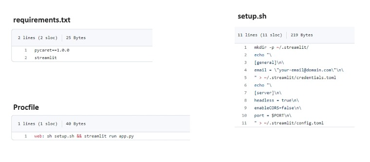

# **Déploiement des services ML sur Heroku**

| PLAN                                                             |
|------------------------------------------------------------------|
| 95. Fondamentaux d'Heroku                                        |
| 96. Laboratoire pratique: déploiement d'un service ML sur Heroku |

## Fondamentaux d'Heroku  

#### **I) Héroku**

+ `Heroku` est une plateforme de services cloud. Facile à utiliser. Axé sur la prise en charge des applications centrées sur le client. `Heroku` gère le matériel et les serveurs.

#### **II) Fichiers nécessaires**

+ Pour déployer le service sur Heroku trois fichiers sont nécessaires dans le référentiel de code.

## Laboratoire pratique: déploiement d'un service ML sur Heroku

#### I) Projet Heroku

+ Nous allons utiliser Heroku pour déployer l'application `healthcare charge prediction web` développée avec `Pycaret` et `Streamlit`.

