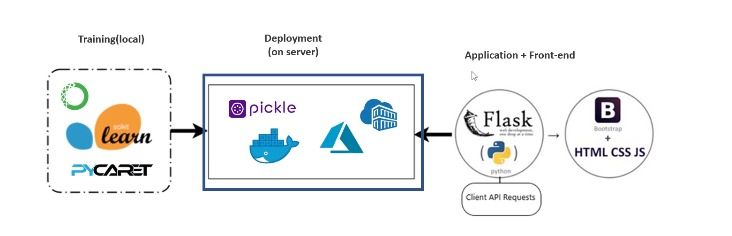

# Déployer sur Azure Cloud avec Azure Container et Azure SDK

| PLAN                                                                          |
|-------------------------------------------------------------------------------|
| 90. Introduction à l'apprentissage automatique dans le cloud                  |
| 91. Mettre l'application ML en production dans Azure Container avec Docker    |
| 92. SDK et Azure Blob Storage pour le déploiement de modèles sur Azure        |
| 93. Formation de modèles et déploiement de production dans Azure Blob Storage |
| 94. Téléchargez le modèle Azure Blob Storage et obtenez des prédictions       |

## Introduction à l'apprentissage automatique dans le cloud

**1) Importance du cloud**

+ Le `ML` est hors de portée pour la plupart des entreprises en raison du niveau élevé de spécialisation qu'il nécessite, des coûts de mise en œuvre élevés et des difficultés de mise à l'échelle. Le `ML` dans le `cloud` présente de nombreux avantages, tels que :

  + **Efficacité des coûts**
  + **Évolutivité**
  + **Moins de spécialisation**
  + **Expérimentation**

**2) Architecture**

## Mettre l'application ML en production dans Azure Container avec Docker

**1) Déployer sur un conteneur `Azure`**

+ Nous pouvons déployer notre modèle dans le cloud à l'aide de `Docker Containers`. Dans cet exemple, nous allons tester le déploiement du modèle sur `Azure Container Registry`.

**2) Déploiement de conteneurs dans `Azure`**

+ Nous allons déployer le conteneur de l'application que nous avions développé à partir de `flask` et `HTML` dans `Azure`. Pour ce faire, nous utiliserons `Azure Container Registry` pour télécharger l'image `Docker`.

**3) Étapes de déploiement sur `Azure Container Registry`**

1) Créer un service `Azure Container Registry`. Vous allez créer le service avec le nom d'abonnement pycaret3.
2) Connexion. Connectez-vous à `Azure Container Registry` à partir de l'invite Anaconda avec la commande `docker login pycaret.azurecr.io`. Entrez le nom et les informations d'identification du "code d'accès".
3) Push vers le conteneur Azure. Pour ce faire, vous entrerez la commande : `docker push pycaret.azurecr.io/pycaret-insurance:latest`.
4) Service d'application Web. Créez un service d'application Web avec cette configuration : `Publish=Docker Container`, dans `Docker-image source=Azure Container Registry, Image=Pycaret, Tag=latest`.

## SDK et Azure Blob Storage pour le déploiement de modèles sur Azure

**1) Déploiement de modèles sur un stockage Blob**

+ Une autre façon de déployer des modèles dans le cloud Azure consiste à les enregistrer sous forme de fichier binaire dans le stockage `Azure Blob`. Pour personnaliser ce modèle, nous pouvons télécharger le modèle à partir du stockage Blob et l'utiliser pour obtenir des prédictions avec de nouvelles données.

**2) SDK Azure**

+ Les `SDK Azure` sont des collections et des fonctions créées pour faciliter l'utilisation des services `Azure` avec différents langages. Ils sont conçus pour être cohérents, accessibles et fiables.

**3) Gestion des `Blob` avec les `SDK Python`**

Les `Blobs` sont des objets qui contiennent de grandes quantités de données non structurées (données texte ou binaires, images, documents ou fichiers). Il existe les classes Python suivantes pour interagir avec les ressources :

+ `BlobServiceClient `:

  + vous permet de manipuler `Azure Storage` et les `conteneurs`.

+ `ContainerClient` : permet de manipuler les conteneurs `Azure Storage` et leurs `blobs`.

+ `BlobClient` : permet de manipuler les blobs depuis `Azure Storage`.

