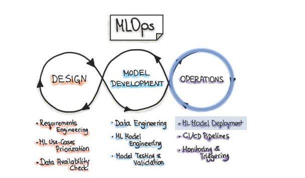
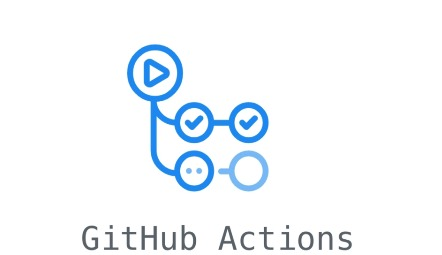
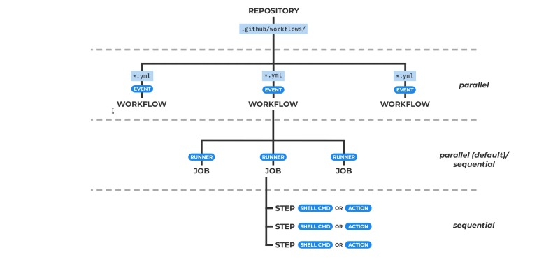
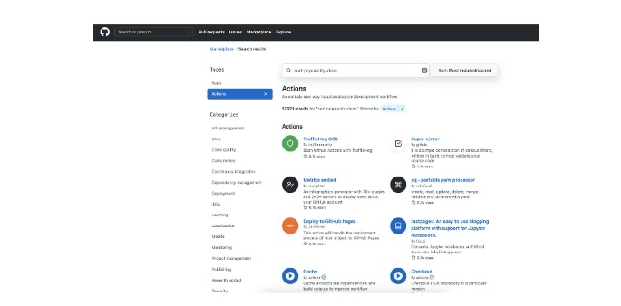
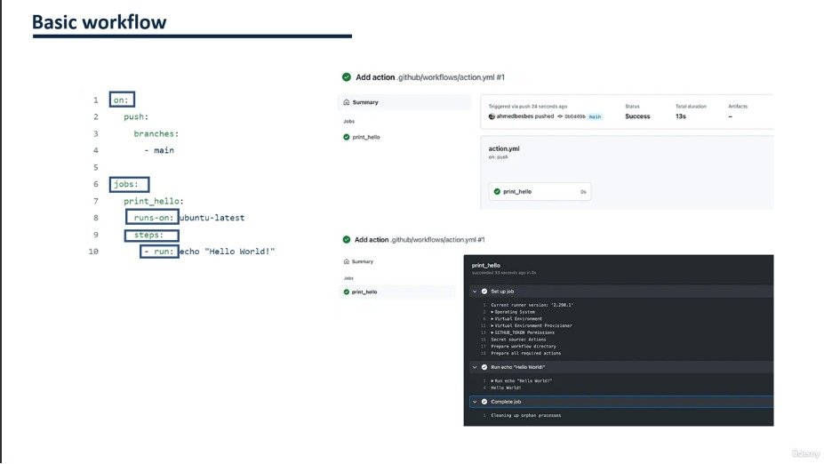
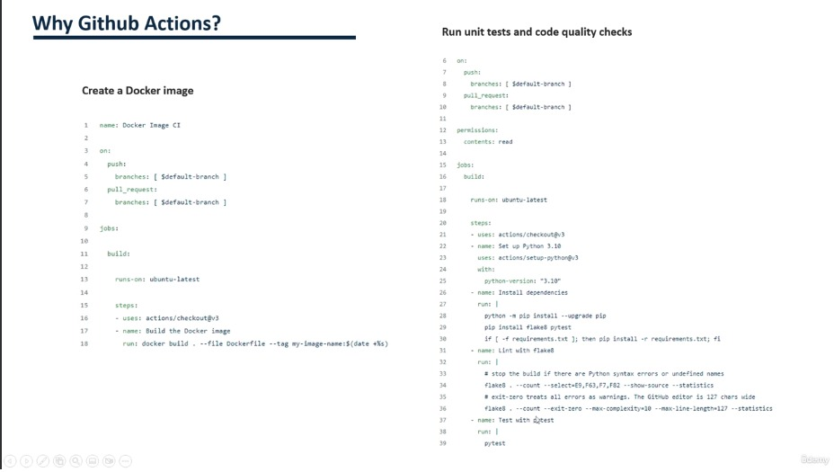
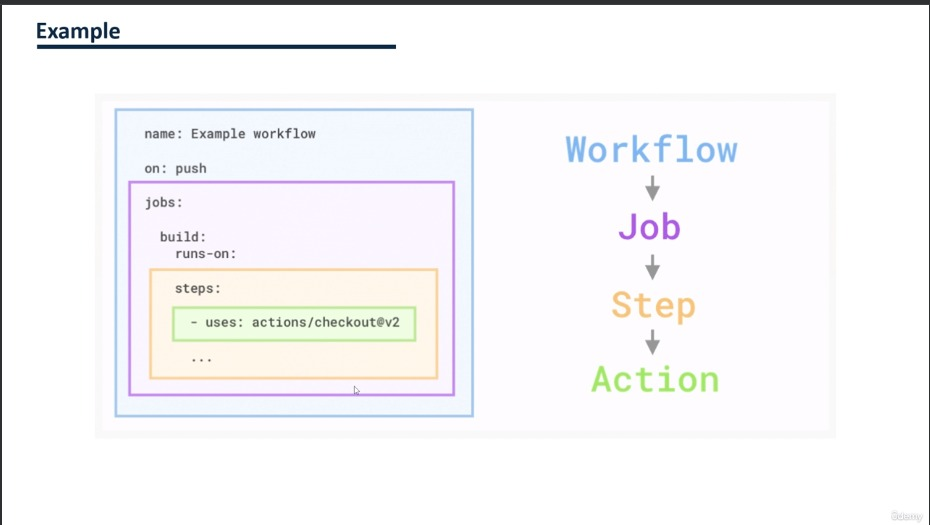
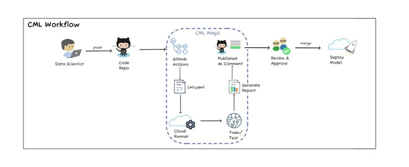
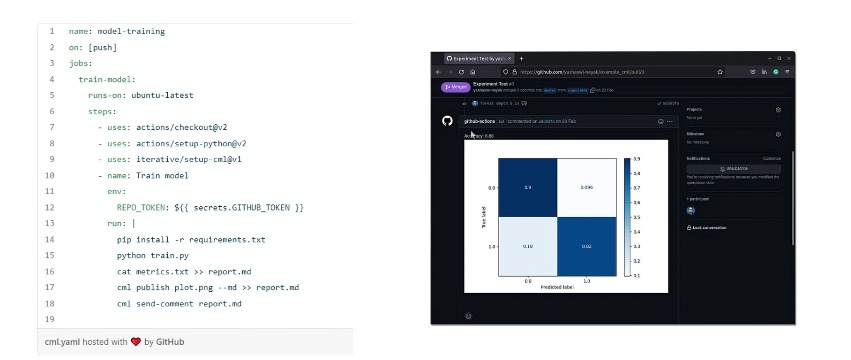

# **Intégration et livraison continues (CI/CD) avec github Actions et actions et CML**

|PLAN|
|-----|
|97. Introduction aux actions GitHub|
|98. Flux de travail de base des actions GitHub|
|99. Laboratoire pratique GitHub Actions|
|100. CI avec apprentissage automatique continu (CML)|
|101. Cas d'utilisation de la CML|
|102. Laboratoire pratique: application des actions GitHub et du CML aux MLOps|
|103. Laboratoire pratique: suivi des performances avec les actions GitHub et CML|

## **Introduction aux actions GitHub**

#### A) MLOPS Stage

#### **B) Pour quoi ?**
+ Imaginez que votre entreprise crée un service alimenté par ML. Une fois que vous avez trouvé un meilleur modèle, comment vous assurer que le service ne sera pas interrompu lorsque vous implémenterez le nouveau modèle ?

#### **C) Présentation des actions Github**
+ `Github Actions` est une plateforme qui `automatise la création, les tests et le déploiement de logiciels`. Il vous permet également d'exécuter du code après un événement spécifique.

#### **D) Composants des actions Github**
+ Github Actions a différents composants.

#### **E) Marché des actions Github**
+ Vous pouvez créer vos propres actions Github ou réutiliser certaines actions open source du marché Github.

## Flux de travail de base des actions GitHub

## Laboratoire pratique GitHub Actions

## Cas d'utilisation de la CML

#### **A) Pourquoi aurions-nous besoin de CML**

+ Pour mettre un modèle en production, nous aurions besoin de plusieurs vérifications, telles que les suivantes :
  + Peut-on reproduire le modèle ?
  + Utilisons-nous la bonne version de l'ensemble de données ?
  + Les mesures de performance sont-elles vérifiables ?
  + etc.

#### **B) Qu'est-ce que la CML**
+ `L'apprentissage automatique continu (CML)` est un outil CLI open source pour la mise en œuvre de l'intégration et de la livraison continues (CI/CD) en mettant l'accent sur MLOps. Utilisez-le pour automatiser les flux de travail de développement, notamment le provisionnement des machines, la formation et l'évaluation des modèles, la comparaison des expériences de ML dans l'historique du projet et la surveillance des ensembles de données changeants.
+ `CML` améliore le déploiement en production de modèles ML, en introduisant un flux de travail continu pour le provisionnement des instances cloud, la formation des modèles sur celles-ci, la collecte de métriques, l'évaluation des performances et la publication de rapports.

#### **Comment fonctionne la CML ?**

#### **Exemple d'utilisation de la CML**

##  Cas d'utilisation de la CML

[CML_USE_CASES](https://github.com/iterative/cml?tab=readme-ov-file#getting-started)

