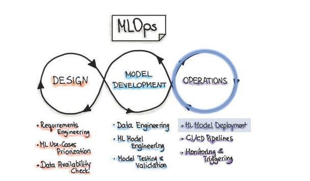
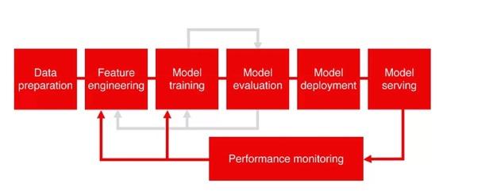
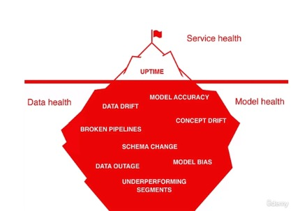
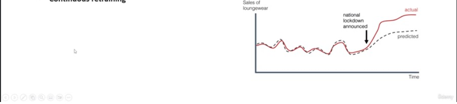
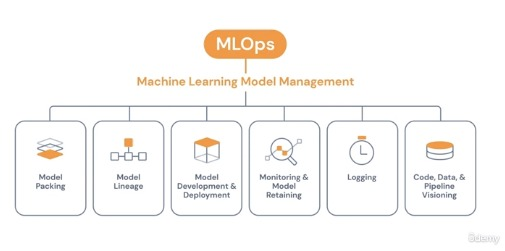
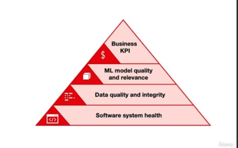
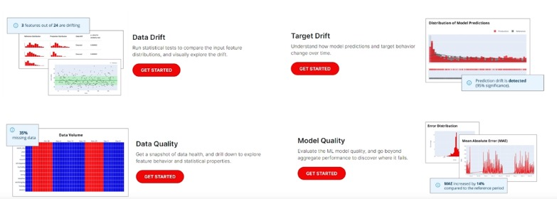
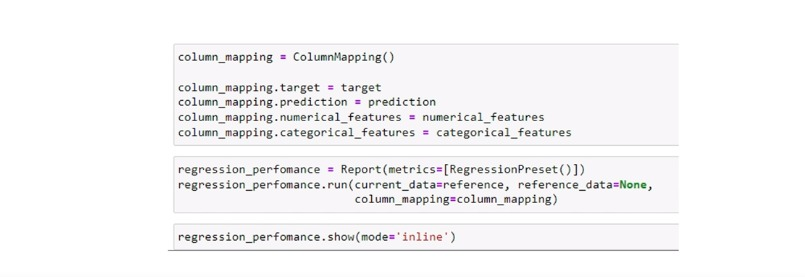
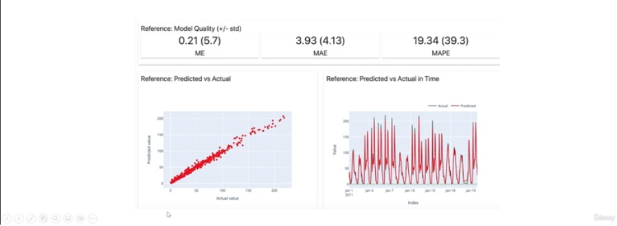
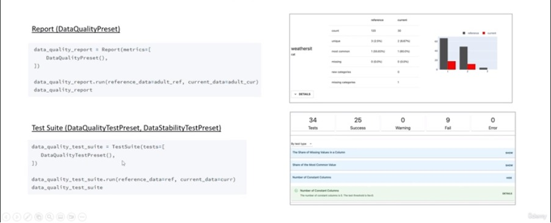

# BentoML pour le développement automatisé de services ML

| PLANIFIER                                                             |
|-----------------------------------------------------------------------|
| Introduction à la surveillance des modèles et services ML             |
| Dérive des données, dérive des concepts et performances du modèle     |
| Modèle ML et outils de surveillance des services                      |
| Évidemment, les fondamentaux de l'IA                                  |
| Dérive et qualité des données, dérive des cibles et qualité du modèle |


## I) Introduction à la surveillance des modèles et services ML

#### A) MLOPS Stage



#### B) Maintenir la qualité du modèle
+ **Les performances du modèle peuvent fluctuer au fil du temps en raison de changements dans l'ensemble de données de production. Par conséquent, il est nécessaire de surveiller le modèle et le service pour s’assurer qu’ils fonctionnent comme prévu.**



#### C) Type de problèmes
+ Il existe différentes catégories de problèmes pouvant survenir avec le service ML :
    + `Des données de mauvaise qualité`, des pipelines cassés ou des problèmes techniques entraînent une baisse des performances.
    + `Dérive des données/Data Drift`. C'est le changement dans la distribution des données. Le modèle fonctionne moins bien dans les régions d’ensembles de données inconnues.
    + `Dérive conceptuelle/Concept Drift`. La relation entre la variable cible et les entités en entrée change.
  



## II) Dérive des données, dérive des concepts et performances du modèle

#### [A) Dérive des données/Data Drift](https://docs.evidentlyai.com/presets/data-drift)

+ **Cela se produit en raison de modifications dans les données d'entrée. Pour le détecter, vous devez observer les données d'entrée en production et les comparer avec les données de formation.**
+ **Tests pour détecter les changements dans la distribution des données d'entrée :**

    + **`Test de Kolmogorov-Smirnov(KS)`**
    + **`Indice de stabilité de la population (PSI)`**
    + **`Z-score`**


#### B) Dérive des concepts

+ La `Dérive conceptuelle/ Drift Concept` fait référence au `changement` dans la relation entre les données d'entrée et de sortie dans le problème sous-jacent `au fil du temps`. 
+ Vous pouvez le détecter en examinant les changements dans les probabilités de prédiction d'entrée. Exemple : l'inflation dans la prévision des prix de l'immobilier.
+ Prévenir la dérive des concepts :
  + **Suivi du modèle**
  + **Approche basée sur le temps, recyclage du modèle toutes les *X* fois**
  + **Reconversion continue**



#### C) Performances du modèle

+ **Le « suivi des performances » nous aide à détecter qu'un modèle de production est sous-performant et pourquoi il est sous-performant. De plus, il est nécessaire de définir ce qui est considéré comme faible performance, car cela dépendra du cas d'utilisation.**

+ **Pour améliorer les performances :**

  + *Conserver le prétraitement des données et le modèle ML dans des modules séparés*
  + *Utiliser un modèle de référence*
  + *Architecture de modèle facilement recyclable*




##  Modèle ML et outils de surveillance des services

#### Liste des évaluations

+ **Un système de suivi adéquat doit couvrir les révisions suivantes :**

  + *Examiner la distribution des données*
  + *Revoir les biais entre formation et service*
  + *Problèmes d'identité dans les pipelines*
  + *Problèmes de performances identitaires*
  + *Service qualité des données*



#### B) Outils de surveillance
+ Il existe différents outils de suivi, mais les plus pertinents sont :

  + [Aporia](https://www.aporia.com/learn/intro/)
  + [Deepchecks](https://docs.deepchecks.com/stable/getting-started/welcome.html)
  + [Evidently AI](https://docs.evidentlyai.com/)
  + [MLRun](https://docs.mlrun.org/en/latest/index.html)


## Évidemment, les fondamentaux de l'IA

#### A) Evidently AI

+ `Evidently AI` est l'un des meilleurs outils émergents. Générez évidemment des tableaux de bord interactifs qui peuvent être utilisés pour l'évaluation, le débogage et la documentation du modèle. Chaque rapport couvre un aspect particulier des performances du modèle.

  + `Dérive des données/ Data Drift`. Exécutez des tests statistiques pour comparer les répartitions des caractéristiques d'entrée et explorez visuellement la saleté.
  + `Qualité des données/ Data Quality`. Obtenez un instantané de l’état des données et explorez le comportement des fonctionnalités et les propriétés statistiques.
  + `Dérive cible/ Target Drift`. Comprenez comment les prédictions et le comportement des cibles évoluent au fil du temps.
  + `Qualité du modèle/ Model Quality`. Évaluez la qualité du modèle ML et allez au-delà des performances globales pour découvrir où il échoue.
  




#### B) Commandes Evidently

+ **Pour faire fonctionner `Jupyter Notebook`, nous devons exécuter ces commandes pour installer `nbextension` dans l'invite :**

```
$ jupyter nbextension install --sys-prefix --symlink --overwrite --py evidently
$ jupyter nbextension enable evidently --py --sys-prefix
```





#### C) Informations Complémentaires
+ Il existe deux types de validations :

  +  **`Metric Presets` : Rapports prédéfinis pour l'exploration visuelle. Exportable vers `JSON`.**
  + **`Test Presets` : suites de tests prédéfinies pour les tests dans le cadre du pipeline.**





# En Savoir Plus


| Outils                                        | Description                                                      | Liens                                                                                                                                                                                                             |
|-----------------------------------------------|------------------------------------------------------------------|-------------------------------------------------------------------------------------------------------------------------------------------------------------------------------------------------------------------|
| Notebook environnements (Jupyter, Colab, etc) | Rendre visuellement les rapports et les suites de tests.         | [Docs](https://docs.evidentlyai.com/integrations/notebook-environments) <br/> [Code examples](https://docs.evidentlyai.com/examples)                                                                              |
| Streamlit                                     | Créez une application Web avec Evidently Reports.                | [Docs](https://www.evidentlyai.com/blog/ml-model-monitoring-dashboard-tutorial) <br/> [Code examples](https://github.com/evidentlyai/evidently/tree/main/examples/integrations/streamlit_dashboard)               |
| MLflow                                        | Enregistrez les métriques calculées par `Evidently` dans MLflow. | [Docs](https://docs.evidentlyai.com/integrations/evidently-and-mlflow) <br/> [Code examples](https://github.com/evidentlyai/evidently/blob/main/examples/integrations/mlflow_logging/mlflow_integration.ipynb)    |
| DVCLive                                       | Enregistrer les métriques calculées par `Evidently` dans DVC.    | [Docs](https://docs.evidentlyai.com/integrations/evidently-and-dvclive) <br/> [Code examples](https://github.com/evidentlyai/evidently/blob/main/examples/integrations/dvclive_logging/dvclive_integration.ipynb) |


