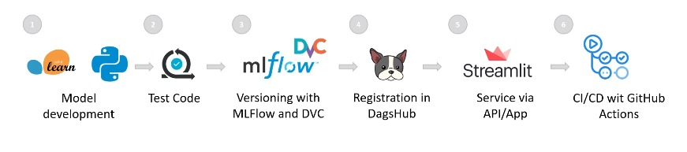
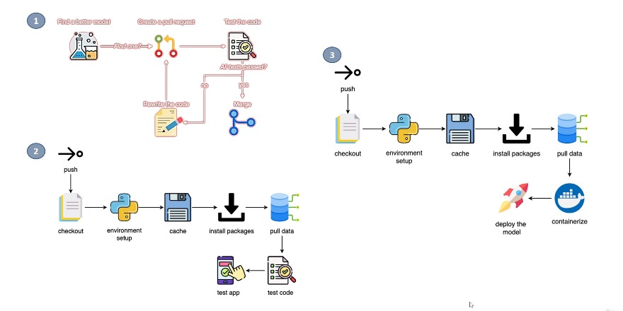

# Projet MLOps de bout en bout**


| PLAN                                                                                 |
|--------------------------------------------------------------------------------------|
| 109. Projet MLOps de bout en bout                                                    |
| 110. Développement du modèle ML                                                      |
| 111. Validation de la qualité du code, du modèle et du prétraitement                 |
| 112. Versionnement de projet avec MLFlow et DVC                                      |
| 113. Dépôt partagé avec DagsHub et MLFlow                                            |
| 114. Développement d'API avec BentoML                                                |
| 115. Développement d'applications avec Streamlit                                     |
| 116. CI-CD : workflow de validation des données avec actions GitHub                  |
| 117. CI/CD : validation des fonctionnalités de l'application avec les actions GitHub |
| 118. CI/CD : déploiement automatisé d'applications avec GitHub Actions et Heroku     |


#### **I) End-to-End Project**

+ ***Nous développerons un projet du début à la fin où nous effectuerons les tâches suivantes :***

   + Code Khuyen Tran (il est recommandé de le suivre) :

     + https://dagshub.com/khuyentran1401/employee-future-prediction/src/master





#### **I) Project Structure**

+ Structure du projet
   + `application : `application et `API` avec `Streamlit` et `BentoML`
   + `config : ` se compose de fichiers de configuration
   + `data : ` où les données sont stockées
   + `models : ` où sont stockés les modèles déjà entraînés
   + `notebooks: ` magasin de notebooks pour analyser visuellement les résultats/données
   + 'formation'
     + `src : ` Codes Python pour le développement de modèles
     + `tests : ` se compose de fichiers de test
     

```
> pyhton -m venv .venv
> .venv\Scripts\activate.bat
> pip install -r requirements.txt
> python training/src/main.py
> pytest training/tests
```


#### Github Actions Workflow



